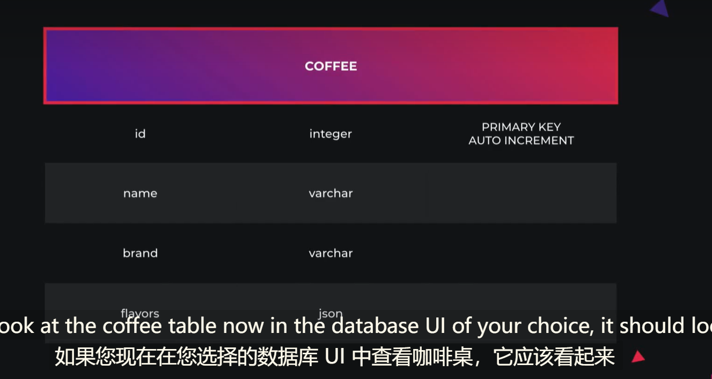

_使用容器来部署应用程序成为容器化_

_容器：灵活 轻量级 便携_

_这意味着可以在本地构建他们 部署到云端并在任何地方运行_

_从根本上说 容器只是一个正在运行的进程 其中应用了一些附加的封装特性 这有助于保持容器与主机和其它内容隔离_

`Docker`

`Docker Compose` 是一个用于定义和运行多个容器 Docker应用程序的工具 也可以使用yaml文件来配置我们的应用程序服务

_一旦我们设置好了所有的东西，只需要一个命令
我们就可以在任何机器上从我们的配置中创建和启动所有服务--------Docker将使我们的应用程序在未来的工作中变得更加简单_

### 23. Introducing the TypeORM Module

**CLI:指令：**

> nest install nestjs/typeorm pg

**app.module.ts**

### 24. create a typeORM Entity

`synchronize` 始终保持你的数据库模式同步 配合$Entity（）同步装饰器自动会从所有类生成一个SQL表 以及包含的元数据--节省了大量去手动编码

**app.module.ts**

```ts
//decorators（n:装饰器)
//nest makes (extensive use of)(广泛使用) decorators
@Module({
  imports: [
    CoffeesModule,
    TypeOrmModule.forRoot({
      type: 'postgres',
      host: 'localhost',
      port: 5432,
      username: 'postgres',
      password: 'postGres',
      database: 'task-management',
      //如何在类型的帮助下转换为数据库表和模式 也可以明确的加载单个实体 也可以说是自动加载单个实体 然后他们会为你找到这些实体文件并未你加载他们
      autoLoadEntities: true,
      // 始终保持你的数据库模式同步
      // 配合$Entity（）同步装饰器自动会根据使用的类生成一个SQL表 以及包含的元数据--节省了大量去手动编码
      //⭐还有请记住这个仅用于开发模式
      synchronize: true,
    }),
  ],
  controllers: [AppController], //controller : controls the invocation of the service
  providers: [AppService], //create more services to facilitate isolation
})
export class AppModule {
}
```

**coffee.entity.ts**

_正如我们上面提及到每一个Entity 就代表一个SQL表_

```ts
// SQL table === coffee
//我们也可以通过从Entity（‘’） 传入一个字符串去命名
//我们类中使用到的装饰器注释每一个属性都会映射到表列
//让我们开始表的主键----让我们使用一个名为@PrimaryGeneratedColumn()的新装饰器并用它装饰这个“id”属性-----这个列不仅会自定义主列 还会自动增加值  

@Entity()

export class Coffee {
  @PrimaryGeneratedColumn()
  id: number;
  @Column()
  name: string;
  @Column()
  brand: string;
  // 数组可选---
  // 下面操作typeORM将以数组存储为JSON -- 可为空 -- 默认都是不能为空的
  @Column('json', { nullable: true })
  flavors: string[];
}
```

_接下来的操作我们需要让 TypeORM知道这个子模块本身内部的实体。_

**coffee.module.ts**

```ts
//..
import { TypeOrmModule } from "@nestjs/typeorm";
import { Coffee } from "./coffee.entity";

@Module({
  //此处使用forFeature()将TypeORM注册到此子模块中。
  //所有其他模块都将使用forFeature()。
  imports: [TypeOrmModule.forFeature([Coffee])],
  controllers: [CoffeesController],
  providers: [CoffeesService],
})
export class CoffeesModule {
}
```

varchar integer JSON


### 25. Using Repository to Access(访问) Database

_这意味着我们创建的每个实体都有自己的存储库。_

**coffee.service.ts**

```ts
//我们现在可以使用从@nestjs/typeorm包导出的@InjectRepository装饰器将自动生成的“存储库" ---- 注入到我们CoffeeService中
//...
import { InjectRepository } from "@nestjs/typeorm";
import { CreateCoffeeDto } from "./create-coffee.dto";

@Injectable()
export class CoffeesService {
  // private coffees: Coffee[] = [
  //   {
  //     id: 1,
  //     name: 'Shipwreck Roast',
  //     brand: 'Buddy Brew',
  //     flavors: ['chocolate', 'vanilla'],
  //   },
  // ];

  //注入
  constructor(
    // 上面Coffee数组作为我们的模拟内存数据源 ---  由无我们现在使用的是真实数据库，我们不再需要这个模拟实现
    @InjectRepository(Coffee)
    private readonly coffeeRepository: Repository<Coffee>
  ) {
  }

  //数据库操作都涉及到async await
  findAll() {
    return this.coffeeRepository.find()
  }

  async findOne(id: number) {
    const coffee = await this.coffeeRepository.findOne(id)
    if (!coffee) {
      throw new NotFoundException(`Coffee #${id} not found`);
    }
    return coffee;
  }

  //去顶安全性我们还是使用Dto
  create(createCoffeeDto: CreateCoffeeDto) {
    //对于这个方法,°我们需要做的第一件事是根据我们的部分DTO创建一个Coffee类实例
    //创建一个Coffee类实例
    //我们需要做的就是调save()方法，它会返回一个Promise. 将会保存到数据库中
    const coffee = this.coffeeRepository.create(createCoffeeDto)
    return this.coffeeRepository.save(coffee)
  }

  async update(id: number, updateCoffeeDto: CreateCoffeeDto) {
    //preload首先查看数据库中是否存在实体，如果存在，则检索它以及与之相关的所有内容。
    //如果实体已经存在，preload会将所有值替换为 在我们的UpdateCoffeeDto 中传入的新值。o如果在数据库中未找到传入的实体的“id”，则preload方法将返回undefined
    const coffee = await this.coffeeRepository.preload({
      id: +id,
      ...updateCoffeeDto,
    });
    if (!coffee) {
      //update the existing entity
      return new NotFoundException(`Coffee #${id} not found`);
    }
    return
    return this.coffeeRepository.save(coffee)
  }

  //默认情况下，每个路径参数和查询参数都以string. 在上面的示例中，我们将id类型指定为 a number（在方法签名中）。因此，ValidationPipe将尝试自动将字符串标识符转换为数字。
  async remove(id: number) {
    const coffee = await this.findOne(id);
    return this.coffeeRepository.remove(coffee)
  }

//...
}
```

_我们现在使用的是一个真实的数据库，我们已经成功地触及了TypeORM的许多基本方面,_
_它的目标是始终支持最新的 JavaScript 特性并提供额外的特性以帮助你开发任何使用数据库的（不管是只有几张表的小型应用还是拥有多数据库的大型企业应用）应用程序。---
ORM 对象关系映射
计算机科学中的对象关系映射（ORM、O/RM和O/R 映射工具）是一种用于在关系数据库和面向对象编程语言的堆之间转换数据的编程技术。这实际上创建了一个可以在编程语言中使用的
虚拟对象数据库。
_

### 26. Create a Relation between two Entities

`OneToOne`
`OneToMany`
`ManyToMany`

**coffee.entity.ts**

```ts
import {
  Column,
  Entity,
  ManyToMany,
  JoinTable,
  PrimaryGeneratedColumn,
} from 'typeorm';
import { Flavor } from "./flavor.entity";

@Entity()
export class Coffee {
  @PrimaryGeneratedColumn()
  id: number;
  @Column()
  name: string;
  @Column()
  brand: string;
  // 数组可选---
  // 下面操作typeORM将以数组存储为JSON -- 可为空 -- 默认都是不能为空的
  @JoinTable()
  //第一个参数 返回对相关函数的引用
  //Flavor实体
  //第二个参数 我们传入一个箭头函数 该函数返回相关实体 指定选择需要返回的属性
  @ManyToMany(() => Flavor, flavor => flavor.coffees)
  flavors: string[];
}

```

_请注意，当我们在开发模式下运行我们的应用程序时，TypeORM会自动为我们添加这些表。_
_这是由于设置了“同步" true, 但再次确保为生产禁用此功能_

**flavor.entity.ts**

```ts
import { Column, Entity, ManyToMany, PrimaryGeneratedColumn } from 'typeorm';
import { Coffee } from './coffee.entity';

@Entity()
export class Flavor {
  @PrimaryGeneratedColumn()
  id: number;

  @Column()
  name: string;

  @ManyToMany(() => Coffee, (coffee) => coffee.flavors)
  coffees: Coffee[];
}
```

_完成我们两个实体间创建了多对多的关系_

### 27.Retrieve Entities with their Relations

**coffees.service.ts**

```ts
//...
@Injectable()
export class CoffeesService {
//...
  findAll() {
    // 指示应该加载哪些实体关系(简化的左连接形式)------ relations
    return this.coffeeRepository.find({ relations: ['flavors'] });
  }

  async findOne(id: number) {
    const coffee = await this.coffeeRepository.findOne({
      where: {
        id,
      },
      relations: ['flavors'],
    });
    if (!coffee) {
      throw new NotFoundException(`Coffee #${id} not found`);
    }
    return coffee;
  }

// {
  //"id": 2,
  //"name": "Coffee #2",
  //"brand": "Nest",
  //"flavors": []   加载完成
//},
//...
}
```

### 28. Using Cascading Inserts and Updates

_要为插入和更新启用级联，让我们在关系内部将Cascade属性设置为true_

**coffee.entity.ts**

```ts
import {
  Column,
  Entity,
  ManyToMany,
  JoinTable,
  PrimaryGeneratedColumn,
} from 'typeorm';
import { Flavor } from './flavor.entity';

@Entity()
export class Coffee {
  @PrimaryGeneratedColumn()
  id: number;
  @Column()
  name: string;
  @Column()
  brand: string;
  @JoinTable()
  @ManyToMany(() => Flavor, (flavor) => flavor.coffees, { cascade: true }// ['insert'])
  flavors: string[];
}
```

**coffees.service.ts**

```ts
//...
@Injectable()
export class CoffeesService {
  constructor(
    @InjectRepository(Coffee)
    private readonly coffeeRepository: Repository<Coffee>,
    // 为此，我们首先需要将Flavor Repository注入到CoffeesService
    @InjectRepository(Flavor)
    private readonly flavorRepository: Repository<Flavor>,
  ) {
  }

  findAll() {
    // 指示应该加载哪些实体关系(简化的左连接形式)------ relations
    return this.coffeeRepository.find({ relations: ['flavors'] });
  }

  async findOne(id: number) {
    const coffee = await this.coffeeRepository.findOne({
      where: {
        id,
      },
      relations: ['flavors'],
    });
    if (!coffee) {
      throw new NotFoundException(`Coffee #${id} not found`);
    }
    return coffee;
  }

  //此方法需要使用map函数遍历CreateCoffeeDTO中的所有风味，
  //将“await”Promise.all()结合使用，
  //让我们等到整个Promise数组完成后再执行进一步的代码。
  //执行完成 我们将在 我们将在定义flavors 变量中得到一个Flavor实体数组
  //现在，我们所要做的就是将createCoffeeDto 与我们更新的Flavor 实体合并
  async create(createCoffeeDto: CreateCoffeeDto) {
    const flavors = Promise.all(
      createCoffeeDto.flavors.map(name => this.preloadFlavorByName(name)),
    )

    const coffee = this.coffeeRepository.create({
      ...createCoffeeDto,
      flavors,
    });
    return this.coffeeRepository.save(coffee);
  }

  async update(id: number, updateCoffeeDto: UpdateCoffeeDto) {
    const flavors =
      updateCoffeeDto && await Promise.all(
        updateCoffeeDto.flavors.map(name => this.preloadFlavorByName(name))
      )
    const coffee = await this.coffeeRepository.preload({
      id: +id,
      ...updateCoffeeDto,
      flavors
    });
    if (!coffee) {
      return new NotFoundException(`Coffee #${id} not found`);
    }
    return this.coffeeRepository.save(coffee);
  }

  //preloadFlavor ByName)。在此方法中，我们将风味名称作为输入参数并返回
  private async preloadFlavorByName(name: string): Promise<Flavor> {
    const existingFlavor = await this.flavorRepository.findOne({ name })
    if (existingFlavor) {
      return existingFlavor
    }
    return this.flavorRepository.create({ name })
  }
}
```

**coffee.entity.ts**

_现在.回到我offeREitityee因为我们在 Relation 中将cascade设置为“true"_
_，所以任何新口味都会自动添加到数据库中，以及_
_任何通过所有内容创建的Coffees以及它们的关系绑定在一起!_

```ts
@Entity()
export class Coffee {
  @PrimaryGeneratedColumn()
  id: number;
  @Column()
  name: string;
  @Column()
  brand: string;
  @JoinTable()
  @ManyToMany(() => Flavor, (flavor) => flavor.coffees)
    //Flavor 类型
  flavors: Flavor[];
}
```

### 29. Adding Pagination

_分页_

`paginationQuery`

**coffees.controller.ts**

```ts
//...
@Controller('coffees')
export class CoffeesController {
  constructor(private readonly coffeesService: CoffeesService) {
  }

  @Get()
  findAll(@Query() paginationQuery) {
    //检索特定数量和特定选择的咖啡。
    return this.coffeesService.findAll();
  }

//...
}
```

_首先创建PaginationQueryDto 类_

_可以被多个控制器重复使用的东西放在这个"公共"文件夹中。_

**pagination-query.dto.ts**

**装饰器：**

`IsOptional` 我们将使用的下一个修饰符是来自类验证器的@IsOptional()。 --- 标记该属性可选

`Type` 第一个是来自“类转换器”包的@Type()装饰符。

```ts
import { Type, IsOptional } from "class-validator";

export class PaginationQueryDto {
  // 首先让我们来给他们添加装饰器
  //第一个是来自“类转换器”包的@Type()装饰符。
  //我们将使用的下一个修饰符是来自类验证器的@IsOptional()。 --- 标记该属性可选

  @IsOptional()
  @Type(() => Number)
  limit: number;

  @IsOptional()
  @Type(() => Number)
  offset: number;
}

```

**coffees.controller.ts**

```ts
//...
import { PaginationQueryDto } from "./pagination-query.dto";

@Controller('coffees')
export class CoffeesController {
  constructor(private readonly coffeesService: CoffeesService) {
  }

  @Get()
  findAll(@Query() paginationQuery: PaginationQueryDto) {
    //检索特定数量和特定选择的咖啡。
    return this.coffeesService.findAll(paginationQuery);
  }

//...
}
```

**coffees.service.ts**

```ts
import { PaginationQueryDto } from "./pagination-query.dto";

@Injectable()
export class CoffeesService {
//...
  findAll(paginationQuery: PaginationQueryDto) {
    const { limit, offset } = paginationQuery
    //Offset (paginated) where from entities should be taken.
    //skip?: number;
    //Limit (paginated) - max number of entities should be taken.
    //take?: number;
    return this.coffeeRepository.find({ relations: ['flavors'], skip: offset, take: limit });
  }

  //...
}
```

### 30. Using Transactions

_处理TypeORM事务有许多不同的策略_，

_但我们建议使用QueryRunner 类，因为它使我们能够完全控制事务_

_Nest范围提供程序和拦截器来自动包装事务中的每个写入查询人 ---- 在未来NestJS高级课程中用到这些技术_

**开始:**

_让我们创建新的实体来表示我们程序中发生的事件_

**event.entity.ts**

```ts
import { Column, Entity, PrimaryGeneratedColumn } from 'typeorm';

@Entity()
export class Event {
  @PrimaryGeneratedColumn()
  id: number;

  @Column()
  type: string;

  @Column()
  name: string;

  @Column('json')
    //有效负载
    //有效负载将是我们可以存储“事件”有效负载的通用列。
  payload: Record<string, any>;
}

```

**coffee.entity.ts**

```ts
//...
@Entity()
export class Coffee {
  //...
  @Column({ default: 0 })
  recommendations: number;
//...
}

```

_现在我们已经设置好了咖啡和事件实体_

**coffee.service.ts**

```ts
import { Connection, Repository } from "typeorm";

@Injectable()
export class CoffeesService {
  constructor(
    @InjectRepository(Coffee)
    private readonly coffeeRepository: Repository<Coffee>,
    @InjectRepository(Flavor)
    private readonly flavorRepository: Repository<Flavor>,
    // private readonly connection: Connection,
    //官方已经给i成立dataSource
    private readonly dataSource: DataSource,
  ) {
  }

  //现翟让我们使用这个Connection对象来创建我们的第一个事务。
  async recommendCoffee(coffee: Coffee) {
    //用于QueryRunner创建和控制单个数据库连接的状态
    const queryRunner = this.dataSource.createQueryRunner()
    //然后使用queryRunner到数据库的新连接
    await queryRunner.connect()
    // 一旦我们建立了连接，我们就可以开始交易过程。
    await queryRunner.startTransaction()

    //我们希望将整个事务代码包装在try/catch/finally 中，以确保如果
    try {
      coffee.recommendations++;

      const recommendEvent = new Event()
      recommendEvent.name = 'recommend_coffee';
      recommendEvent.type = 'coffee';
      recommendEvent.payload = { coffeeId: coffee.id }

      await queryRunner.manager.save(coffee);
      await queryRunner.manager.save(recommendEvent)

      await queryRunner.commitTransaction();
    } catch (err) {
      await queryRunner.rollbackTransaction()
    } finally {
      await queryRunner.release()
    }

  }
}

```

### 31.Adding Indexes to Entities

**event.entity.ts**

根据名称检索一个事件 帮忙加速搜索的速度

我们可以使用@lndex()装饰器在-name-列上定义一个“索引”。

在更高级的情况下，我们可能想要定义包含多个 列的复合索引。

我们可以通过将@Index()装饰器应用到Event类本身，

并在装饰器内传递一个列名数组作为参数来做到这一点。

索引可以帮助我们的应用程序快速随机查找和有效访问

```ts
import { Column, Entity, Index, PrimaryGeneratedColumn } from "typeorm";

@Index(['name', 'type'])
@Entity()
export class Event {
  @PrimaryGeneratedColumn()
  id: number;

  @Column()
  type: string;

  @Index()
  @Column()
  name: string;

  @Column('json')
  payload: Record<string, any>;
}
```

### 32. Setting Up Migrations

在创建新的迁移之前，我们需要创建一个新的TypeORM配置文件并 ormconfig.js

**ormconfig.js**

这里的这些配置设置是我们从 Docker Compose文件中使用的所有端口、密码等，

```ts
module.exports = {
  type: 'postgres',
  host: 'localhost',
  port: 5432,
  username: 'postgres',
  password: 'postGres',
  database: 'postgres',
  entities: ['dist/**/*.entity.js'],
  migrations: ['dist/migrations/*.js'],
  cli: {
    migrationsDir: 'src/migrations',
  },
};
```
**使用以下命令：操作**

> npx typeorm migration:create -n (让我们将此迁移命名为"CoffeeRefactor") 


### 33. Understand Dependency Injection


 


